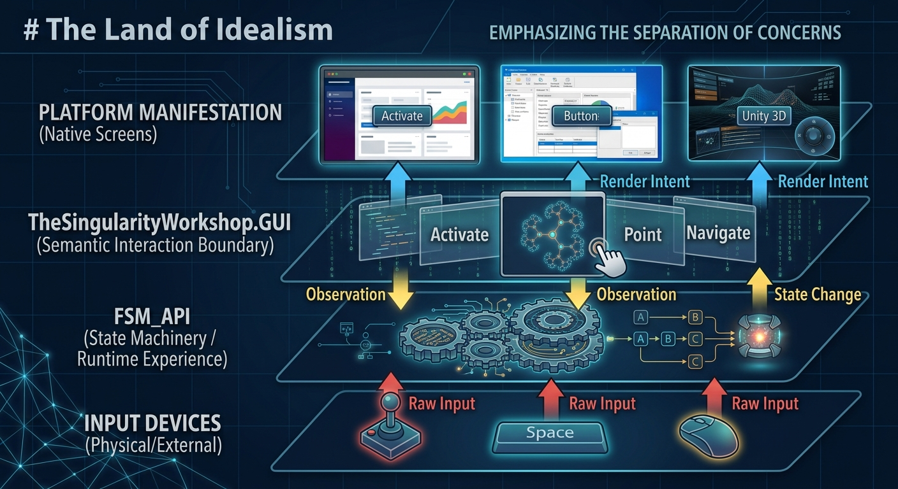

# TheSingularityWorkshop.GUI



A platform-neutral GUI engineering layer with recursive builders and platform adapters.

The repository exists to separate GUI intent from GUI manifestation.

## Repository structure

- src/Core — the neutral recursive GUI model, the intrinsic GUI Hub, and platform-independent primitives.
- src/Blazor — Blazor builders and the browser manifestation.
- src/WPF — reusable WPF builders and desktop manifestation infrastructure.
- tests/Core.Tests — platform-independent contract tests.
- tests/Blazor.Tests — Blazor manifestation tests.
- docs — architecture, model, adapter, and testing contracts.

## Default Core builders

GUI.Core provides the default semantic vocabulary used by platform manifestations.

```csharp
var view = GuiBuilders.Column("settings")
    .Child(GuiKinds.Text, "title", b => b.Text("Settings"))
    .Child(GuiKinds.Button, "save", b => b.Text("Save"))
    .Child(GuiKinds.Warning, "warning", b => b.Text("Changes are not saved yet."))
    .Build();
```

For common controls, the convenience builders are shorter:

```csharp
var save = GuiBuilders.Button("save", "Save").Build();
```

These calls produce a `GuiNode` tree. They do not create WPF controls, Blazor components, HTML, XAML, JavaScript, or browser state.

That makes Core the place to author reusable GUI intent. A platform package then manifests the same semantic tree:

```text
GUI.Core -> GuiBuilders -> GuiNode tree
                             |
                      +------+------+
                      |             |
                  GUI.Blazor     GUI.WPF
```

**Recommended dependency rule:** author shared GUI intent against GUI.Core. Add GUI.Blazor or GUI.WPF only at the platform boundary where that tree is manifested.

## The integrated Hub

The GUI Hub is the default semantic presentation surface for an assembled runtime.

```text
FSM_COS
   |
   +-- assembles Hub MicroBundle
           |
           v
GUI.Core
   |
   +-- defines IGuiHub / GuiHub
           |
           v
GUI.Blazor / GUI.WPF / GUI.Unity...
   |
   +-- manifests the same semantic surface
```

GUI.Core contains no platform rendering dependency. GUI.Blazor contains the browser manifestation. GUI.WPF contains the native desktop manifestation and reusable builder system. The host supplies the Hub MicroBundle to FSM_COS; FSM_COS assembles it alongside the rest of the runtime.

## Current integration

The WebPage repository is the first migration target for the Blazor layer and the proving ground for the integrated Hub boundary.

The intended flow is:

RuntimeManifest -> FSM_COS -> RuntimeAssembly -> Hub MicroBundle -> GUI.Core -> platform adapter

The browser and WPF remain manifestation targets, not dependencies of FSM_COS.

## Package family

The GUI repository contains the platform-neutral contract and its platform manifestations:

| NuGet package | Purpose |
|---|---|
| **TheSingularityWorkshop.GUI.Core** | Semantic GUI model and platform-neutral builders |
| **TheSingularityWorkshop.GUI.Blazor** | Blazor manifestation |
| **TheSingularityWorkshop.GUI.WPF** | WPF manifestation and advanced desktop builders |

The GUI family sits alongside the Workshop runtime packages:

| NuGet package | Purpose |
|---|---|
| **TheSingularityWorkshop.FSM_API** | State and transition runtime |
| **TheSingularityWorkshop.FSM_COS** | Runtime composition and assembly |
| **TheSingularityWorkshop.FSM_Serialization** | FSM serialization infrastructure |
| **TheSingularityWorkshop.MicroBundleDomain** | Microbundle contracts and descriptors |

## Resources

- [The Singularity Workshop GUI](https://github.com/TrentBest/TheSingularityWorkshop.GUI)
- [WebPage / WebForge](https://github.com/TrentBest/WebPage)
- [FSM_API](https://github.com/TrentBest/FSM_API)
- [FSM_COS](https://github.com/TrentBest/TheSingularityWorkshop.FSM_COS)
- [FSM_Serialization](https://github.com/TrentBest/TheSingularityWorkshop.FSM_Serialization)
- [MicroBundleDomain](https://github.com/TrentBest/TheSingularityWorkshop.MicroBundleDomain)
- [FSM_API Unity package](https://github.com/TrentBest/FSM_API_Unity)

### NuGet

- [TheSingularityWorkshop.GUI.Core](https://www.nuget.org/packages/TheSingularityWorkshop.GUI.Core)
- [TheSingularityWorkshop.GUI.Blazor](https://www.nuget.org/packages/TheSingularityWorkshop.GUI.Blazor)
- [TheSingularityWorkshop.GUI.WPF](https://www.nuget.org/packages/TheSingularityWorkshop.GUI.WPF)
- [TheSingularityWorkshop.FSM_API](https://www.nuget.org/packages/TheSingularityWorkshop.FSM_API)
- [TheSingularityWorkshop.FSM_COS](https://www.nuget.org/packages/TheSingularityWorkshop.FSM_COS)
- [TheSingularityWorkshop.FSM_Serialization](https://www.nuget.org/packages/TheSingularityWorkshop.FSM_Serialization)
- [TheSingularityWorkshop.MicroBundleDomain](https://www.nuget.org/packages/TheSingularityWorkshop.MicroBundleDomain)

---

<p align="center">
  <a href="https://github.com/TrentBest/FSM_API">
    
  </a>
</p>

<p align="center">
  <em>The Singularity Workshop — Tools for the curious, the bold, and the systemically inclined.</em><br>
  <strong>Because state shouldn't be a mess.</strong>
</p>
