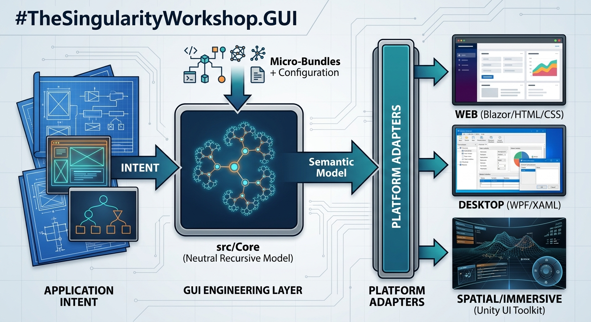

# GUI Visual Reference

The GUI project should preserve useful visual artifacts as **reference manifestations**, not as semantic contracts.

The current reference set covers four documentation questions:

1. What is the ideal boundary?
2. How is that boundary protected from platform details?
3. How can one repository organize the semantic model, adapters, tests, and documentation around it?
4. What does a concrete spatial/operational manifestation look like?

## Reference set

### The Land of Idealism

This image illustrates the separation between physical/external input, FSM_API runtime behavior, the semantic GUI interaction boundary, and platform manifestations.

### The engineering boundary

This image emphasizes the breakwater around the semantic core. Web/Blazor, desktop/WPF, and spatial/Unity are shown as manifestations outside the protected semantic boundary.

### Spatial reference

The Workshop map is the concrete visual companion for the spatial-domain work: it combines a scene, navigation, indexed destinations, text, and operational controls. It provides a useful starting point for asking how a semantic GUI can describe a spatial surface without becoming tied to one renderer.

It belongs with [GUI Spatial Domain](GUI_SPATIAL_DOMAIN.md) and [Spatial Representation](THEORY/06_SPATIAL_REPRESENTATION.md).

### Repository structure

This image is a conceptual repository map. It is intentionally not an exhaustive file listing.

### Workshop map

The Workshop map is a concrete reference manifestation combining navigation, spatial information, indexed destinations, text, and operational controls.

## Asset convention

Generated filenames are renamed to semantic names when they enter the repository:

- ideal-gui-separation-of-concerns.jpg
- gui-engineering-boundary.jpg
- repository-structure-overview.jpg
- workshop-map-reference.jpg

The filename should describe the role of the artifact, not the image generator.

## Why these images belong in the documentation

The images are not merely artwork.

They are **reference manifestations** of architectural ideas.

The important engineering question is not:

> How do we reproduce these pixels?

It is:

> Can the semantic GUI model describe the observable structure represented by the image, and can multiple adapters manifest that structure without changing its meaning?

That makes visual references useful as future golden/reference artifacts while keeping Core platform-neutral.

## Intended progression

1. Start from the visual problem.
2. Identify semantic elements independently of HTML/CSS/WPF/Unity/etc.
3. Express those semantics through Core.
4. Manifest the same semantic artifact through an adapter.
5. Compare the resulting manifestation against the reference where appropriate.

The image therefore becomes evidence for expressiveness, not an implementation dependency.
