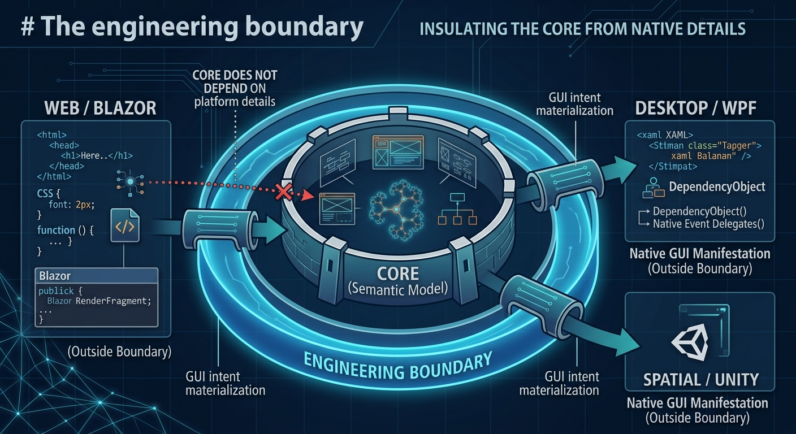

# Platform Adapter Guide

*Platform adapters are the controlled passage from semantic GUI intent to native manifestation.*

A platform adapter is a compiler-like boundary: it consumes the neutral GUI model and materializes it for a target UI technology.

## Adapter responsibilities

An adapter should:

1. consume Core types;
2. map known semantic node kinds;
3. translate supported properties intentionally;
4. preserve child order;
5. report or handle unsupported capabilities explicitly;
6. own platform resources and event lifetimes;
7. avoid changing domain meaning.

## Current adapters

| Adapter | Target | Current role | Dedicated tests |
|---|---|---|---|
| **GUI.Blazor** | Blazor / browser | Semantic manifestation and Hub renderer | Yes |
| **GUI.WPF** | WPF / Windows | Semantic manifestation, Hub renderer, native builder family | Not yet |
| **Unity** | Unity UI Toolkit | Planned | No |

## Blazor

Blazor currently maps the canonical Core vocabulary to Blazor/HTML constructs and applies a limited set of common presentation properties.

It should be treated as a working manifestation layer, not as proof that every semantic capability has a final cross-platform contract.

## WPF

WPF has both a semantic renderer and a native builder surface.

The semantic renderer maps the current Core kinds to WPF controls. The native builders intentionally expose WPF-specific capabilities such as windows, panels, dialogs, reflection-driven editors, diagnostics, and richer control composition.

See [WPF Guide](WPF_GUIDE.md).

## Do not use blind property passthrough

A renderer should not assume that every Core property is a native attribute.

For example, a future Core property named `layout.horizontalAlignment` should be translated by each adapter according to its own platform rules. It should not become an HTML attribute merely because HTML permits arbitrary attributes.

## Capability differences

Platforms are not identical.

An adapter may support more capabilities than another adapter. The correct response is not to contaminate Core with platform-specific APIs.

Instead, capabilities should eventually be:

- declared;
- negotiated;
- degraded predictably; or
- rejected with a useful diagnostic.

That capability contract is not yet implemented.

## Testing adapters

Adapter tests should have two levels:

### Contract tests

Verify that the same Core tree produces the required semantic result.

### Platform tests

Verify native behavior that cannot be represented by Core alone.

The repository currently has Core and Blazor test projects. The WPF Windows build/pack lane is active, but its dedicated test project is intentionally still being established.

This distinction matters: **a green WPF build is not the same thing as a complete WPF conformance suite.**
