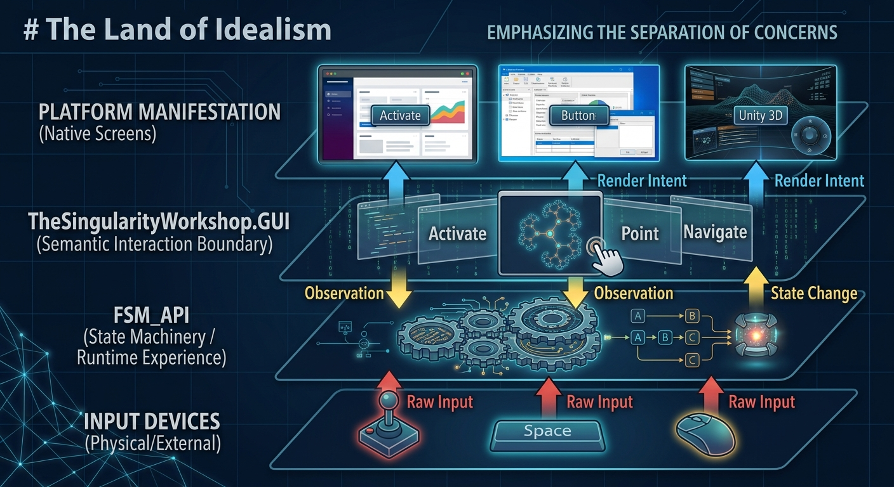
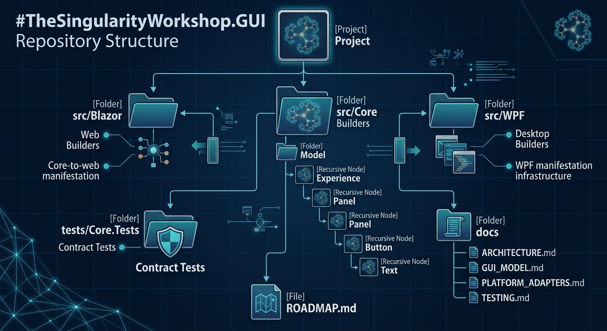
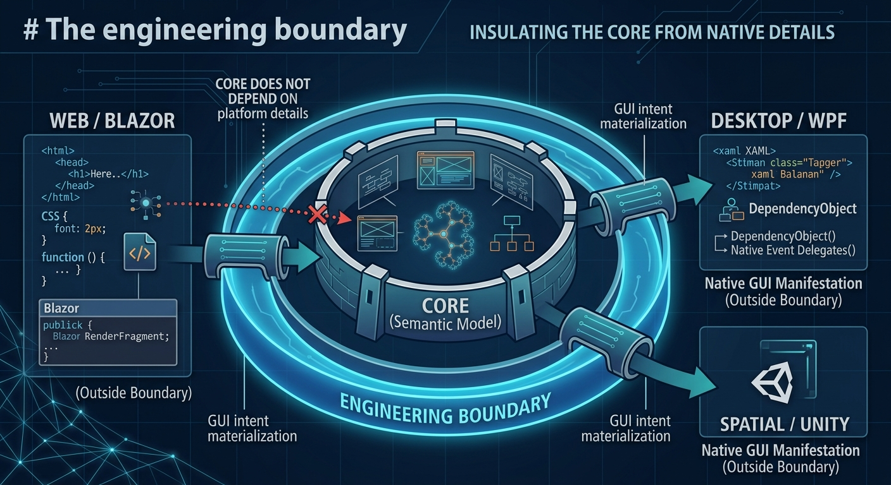

# Start Here: Explore the GUI

If you arrived here thinking:

> "I already know how to build a GUI. What would another abstraction add?"

That is a useful question.

This repository is designed to answer it gradually. Rather than asking you to adopt a new vocabulary all at once, it starts with familiar GUI problems and works outward toward the abstraction.

The fastest way to explore it is **not** to read every document. Follow the two documentation prongs below, but make the first ten minutes experiential: see the Workshop running, then come back to the implementation and ideas behind it.



*Figure 1 — A reference manifestation of the separation this repository is trying to make tangible: runtime behavior, semantic GUI meaning, and platform presentation can cooperate without becoming the same thing.*

---

## The two-prong documentation model

This project documents two different things because they answer two different questions.

### Prong 1 — The technology

**Question:** *How does it work?*

This is the engineering documentation:

- the semantic GUI model
- recursive builders
- platform adapters
- lifecycle
- testing
- execution-boundary design
- repository structure
- implementation constraints
- roadmap and known unfinished contracts

The fastest route is intentionally small.

**Start here:**

- [GUI Model](GUI_MODEL.md) — the neutral semantic tree and current primitives

**Then explore the relevant layer:**

- **Architecture & manifestation:** [Architecture](ARCHITECTURE.md) · [Platform Adapters](PLATFORM_ADAPTERS.md) · [GUI Execution Model](GUI_EXECUTION_MODEL.md)
- **Spatial model:** [GUI Spatial Domain](GUI_SPATIAL_DOMAIN.md) · [GUI Spatial Contracts](GUI_SPATIAL_CONTRACTS.md) · [GUI Visual Reference](GUI_VISUAL_REFERENCE.md)
- **Verification & measurement:** [Testing](TESTING.md) · [GUI Benchmarking](GUI_BENCHMARKING.md) · [Roadmap](../ROADMAP.md)

The repository structure is also documented visually:



*Figure 2 — A conceptual map of how the semantic model, adapters, tests, and documentation fit together. It is not intended to be an exhaustive file listing.*

This prong should let another developer inspect the implementation and answer:

> "What does this thing actually do?"

---

### Prong 2 — The theory

**Question:** *Why is it designed this way, and what larger engineering problem is it trying to solve?*

The theory track treats the project as an engineering thesis rather than a widget library.

It develops concepts such as:

- the GUI as an **extrinsic interface layer**
- the **breakwater principle**
- the **digital shadow**
- **execution-boundary inversion**
- **representational compatibility**
- the separation of semantic intent from platform manifestation
- spatial representation and controlled observation

Start with the [Theory Guide](THEORY_GUIDE.md), then use the [Textbook Map](THEORY_TEXTBOOK_MAP.md) to follow the chapters.

The theory track is deliberately written so that a textbook author can lift a chapter, section, definition, or example with minimal rewriting.

---

# A practical evaluation path

You do not need to agree with the architecture.

Instead, ask five questions.

## 1. Can the semantic model remain platform-neutral?

Open the Core project.

Look for references to:

- HTML
- DOM
- CSS
- JavaScript
- Blazor rendering types
- WPF controls
- XAML
- Unity UI Toolkit

The claim is not that platforms are irrelevant.

The claim is that **platform mechanisms belong at the boundary rather than in the semantic model**.

If Core cannot maintain that boundary, the architecture has failed its own test.

---

## 2. Can the same intent have different manifestations?

The model describes GUI intent before a platform turns it into a concrete interface.

Conceptually:

```
intent
  -> semantic GUI model
      -> platform adapter
          -> manifestation
```

A button is therefore not fundamentally a WPF Button, an HTML element, or a Unity control.

Those are manifestations.

The semantic object is the thing that means:

> "This is an actionable interaction."

The adapter decides how that meaning appears on a particular platform.

---

## 3. Does the abstraction earn its place?

This is the important skeptical test.

If a supposedly neutral abstraction forces developers to write the lowest common denominator of every platform, it has failed.

Neutrality therefore means:

> A concept belongs in Core only when its meaning can be defined independently of a particular platform.

Platform-specific power is not erased. It is moved to an appropriate boundary.

---

## 4. Can the model describe more than conventional widgets?

Try to leave the world of buttons.

Consider:

- a floor plan
- a map
- a state inspector
- a CAD view
- a 3D scene
- a diagnostic visualization
- an image
- a mesh
- animation
- spatial interaction
- accessibility interfaces
- deliberately unstructured visual output

If the architecture only knows how to draw panels and buttons, it is a widget abstraction.

The intended model is larger:

> GUI is a semantic representation and interaction space.

That is a much stronger claim—and therefore a much more useful thing to test.

See [GUI Expressiveness](GUI_EXPRESSIVENESS.md) and [GUI Coverage Survey](GUI_COVERAGE_SURVEY.md).

---

## 5. Does the theory clarify useful engineering boundaries?

The theory is not decoration.

It makes architectural predictions.

For example:

- If GUI is extrinsic, experience identity should not depend on a particular GUI.
- If GUI is a boundary, input translation should occur at that boundary.
- If manifestation is separate from semantics, multiple manifestations can observe the same experience.
- If representation is fundamental, interoperability should not require implementation equivalence.
- If execution belongs at the boundary, `Gui.Execute(...)` can become a host contract rather than a rendering convenience.

Those predictions are useful precisely because they can be challenged.

---

# A ten-minute evaluation

The ten-minute path should begin with the thing this repository is ultimately meant to help build: a working experience.

### 1. See the Workshop

Open the live [The Singularity Workshop WebPage](https://lemon-ground-09f542010.1.azurestaticapps.net/).

Do not begin by reading the architecture.

Interact with it.

Notice what the interface is doing, what changes over time, what feels like state, what feels like presentation, and where the experience crosses from ordinary web UI into something more deliberately expressive.

The live WebPage is the practical proving ground.

The important architectural step is now explicit: the WebPage is being refactored on `development` to consume this GUI repository rather than merely demonstrate similar ideas independently.

### 2. See how the proof is constructed

Open the [WebPage repository](https://github.com/TrentBest/WebPage) on its `development` branch and inspect its reference to this GUI repository.

The migration is tracked in [WebPage issue #52](https://github.com/TrentBest/WebPage/issues/52).

The intended progression is:

```
WebPage experience
      |
      v
TheSingularityWorkshop.GUI semantic model
      |
      v
Blazor adapter
      |
      v
browser manifestation
```

That makes the WebPage more than a demo. It becomes an integration case study: the repository that consumes the abstraction is itself demonstrating what the abstraction is capable of.

### 3. Inspect the boundary

Now return to this repository.

1. Read [GUI Model](GUI_MODEL.md).
2. Inspect `src/Core`.
3. Inspect `src/Blazor`.
4. Inspect `src/WPF`.
5. Read the Core tests.
6. Read [Extrinsic Interface Layer](THEORY/01_EXTRINSIC_INTERFACE_LAYER.md).



*Figure 3 — Platform-specific details can be sophisticated while remaining outside the semantic Core boundary.*

At this point the question becomes concrete: does the code you just inspected provide a useful place to put the semantic layer you observed in the running application?

### 4. Then explore the spatial model

If the WebPage example has made the boundary useful, continue into [GUI Spatial Domain](GUI_SPATIAL_DOMAIN.md) and [GUI Spatial Contracts](GUI_SPATIAL_CONTRACTS.md).

The important example is not a button.

It is one digital reality observed many ways:

```
subject
  -> view
      -> viewport
          -> presentation surface
```

A dozen panels can therefore become a dozen controlled observations of one changing reality rather than twelve unrelated GUI implementations.

For the theory behind that model, see [Spatial Representation and Controlled Observation](THEORY/06_SPATIAL_REPRESENTATION.md).

### 5. Measure it

The next stage is a dedicated GUI benchmark project, after the WebPage has a representative working slice built on the GUI repository.

The benchmark work is tracked in [GUI issue #2](https://github.com/TrentBest/TheSingularityWorkshop.GUI/issues/2).

That benchmark should measure the semantic layer itself—construction, traversal, observation/view composition, multi-view scaling, adapter manifestation, and allocation—without pretending that a GUI abstraction can be summarized by a single number.

See [GUI Benchmarking](GUI_BENCHMARKING.md) for the methodology.

The goal is not to turn a skeptic into a believer. It is to make the tradeoffs visible enough that a developer can decide whether the abstraction removes friction from problems they already have.

---

# What this repository is not claiming yet

The architecture contains ideas that are ahead of the current implementation.

In particular, the execution-host model, capability negotiation, and some of the richer semantic contracts are still being designed.

The roadmap is therefore part of the documentation, not an afterthought.

See [ROADMAP.md](../ROADMAP.md).

The distinction is intentional:

- **Implemented:** inspect the code and tests.
- **Specified:** read the architecture documents.
- **Proposed:** read the theory and roadmap.
- **Unresolved:** find the open boundary in the design and challenge it.

That separation keeps the documentation honest.

---

# The ultimate test

Do not ask:

> "Do I believe in this GUI abstraction?"

Ask:

> "Does this abstraction give me a cleaner place to put a problem that already exists?"

If the answer is no, do not use it.

If the answer becomes yes only after seeing the architecture, implementation, and theory together, that is exactly why the two-prong documentation model exists.
